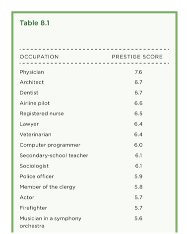
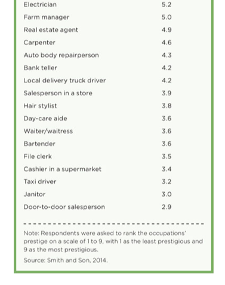
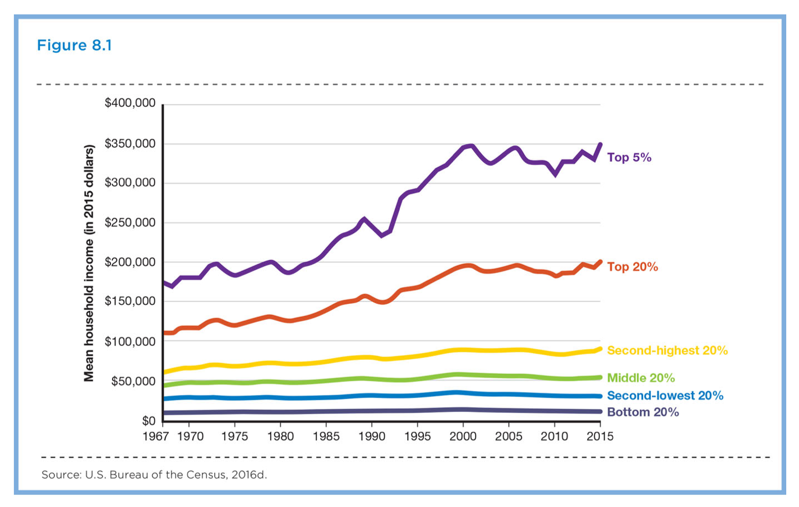

### Social Class & Inequality
SOC100: Introduction to Sociology  
Brian McPhail  
Purdue University

---
@snap[north span-100]
### Stratification
@snapend  
@size[larger](**Stratification** exists not because of individual differences or chance occurrences but because the system is structured to produce inequalities.)
---
@snap[north span-100]
### Stratification
@snapend  
- **structured inequalities**: social inequalities that result from patterns in the social structure  

---
@snap[north span-100]
### Stratification
@snapend  
- **intersectionality**: a sociological perspective that holds that our multiple group memberships affect our lives in ways that are distinct from single group memberships
 
 
Examples?
---
@snap[north spand-100]
### Social Class
@snapend
- **Class systems**: a system of social hierarchy that allows individuals to move among classes
  - **class**: socioeconomic variations among groups of individuals that create variations in their material prosperity and power.
---
@size[larger](What factors structure the class system in the US?)
---
@snap[west span-50]

@snapend

@snap[east span-50]

@snapend
---
@snap[midpoint span-100]

@snapend
---

---
